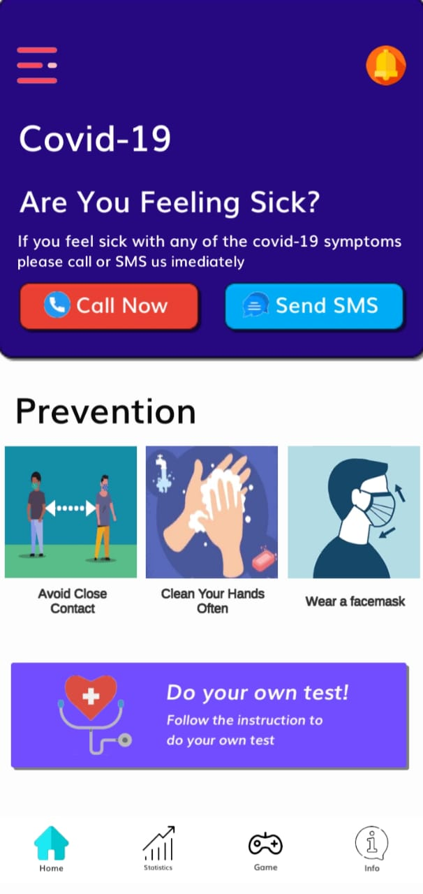
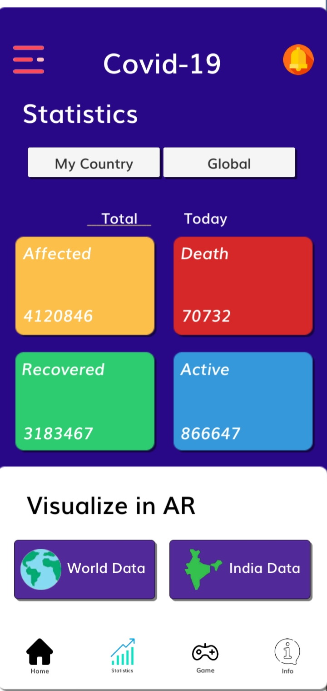
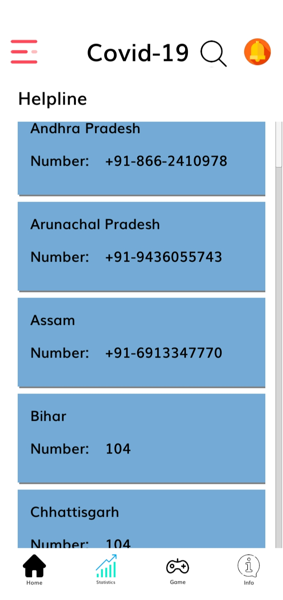
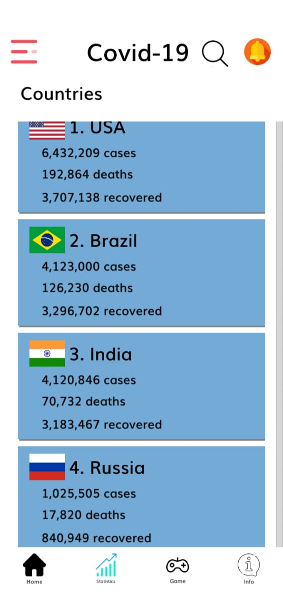
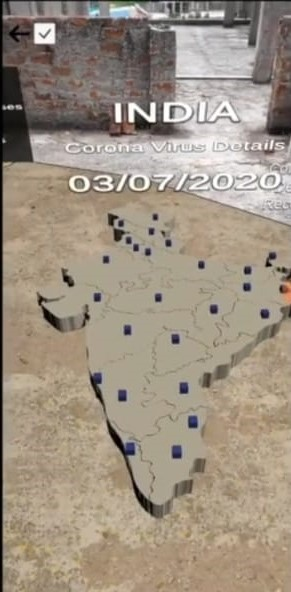
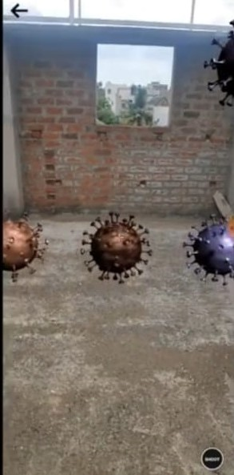

# COVID19AR
  
## Homescreen:
Upon opening our app you will be greeted homescreen in which you can select free the differnt menus available.

  

## Statistics in UI:
In Statistics menu you will be shown the COVID data in UI format and you can further segregated into countries. For India the data in segregated into states.

   
 

## Statistics in AR:
By clicking on the world data you can visualize the globe with the COVID data in Augumented Reality. To place the globe scan the environment after decting plane you can place the globe.
After placing the globe you can move the cursor around globe & countries to visualize the data. 

  

## COVID shooter game: 
COVID shooter is AR based game in which you need to shoot the virus to score which relives from stress.
 
 
 

Developed By :

JOTHESH : https://www.linkedin.com/in/jothesh-j...
MAGESHWARAN : https://www.linkedin.com/in/mageshwar...

PRASHANTH : https://www.linkedin.com/in/prashanth-s-1b9a20191/